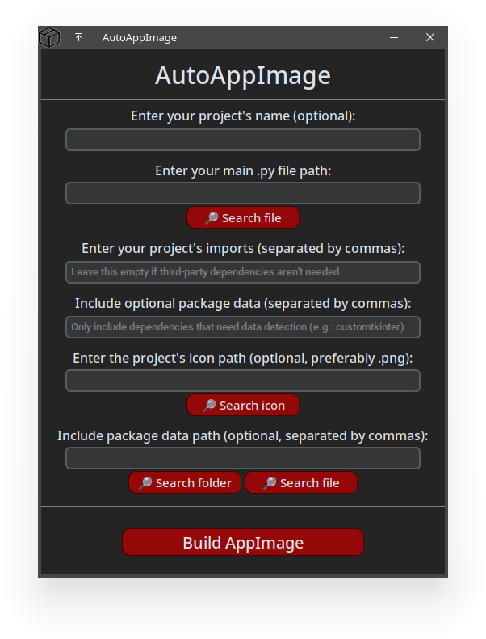

# AutoAppImage
AutoAppImage is a helper for building ELF binaries and turning them into .AppImage with extreme ease!<br>
This application uses the following libraries: CustomTkinter, CTkMessagebox, subprocess, threading, os and sys.<br>
The available [binaries](https://github.com/Guilherme-A-Garcia/AutoAppImage/releases) were compiled with [Nuitka](https://nuitka.net/).

## Table of Contents
<!-- - [Roadmap](#roadmap)-->
- [Current Features](#current-features)
- [Preview](#preview)
- [Requirements](#requirements)
- [How to Use](#how-to-use)
- [Using the Source Code](#using-the-source-code)
- [Acknowledgements](#acknowledgements)
- [How to Contribute](#how-to-contribute)

## Preview


## Current Features
- Simple GUI
- Error handling with message boxes
- Project ELF binary compilation
- Final AppImage executable creation based on ELF binary 

## Requirements
If you're going to use the source code version, you must install the [latest Python version](https://www.python.org/downloads/). 🐍<br>
Otherwise, you will not need to download anything, as AutoAppImage downloads and handles the dependencies.

## How to Use
1. Download the latest release of this project;
2. Give the .AppImage executable permissions with `chmod +xw` and open it;
3. Fill the required fields;
4. Click "Build AppImage;"
5. Wait for the process to end and enjoy the .AppImage!

## Using the Source Code

1.  **Clone the repository:**
    ```bash
    git clone https://github.com/Guilherme-A-Garcia/AutoAppImage.git
    cd Easy-DLP
    ```

2.  **Create and activate a virtual environment** (recommended):
    ```bash
    python3 -m venv venv
    source venv/bin/activate
    ```

3.  **Install the required packages** using the `requirements.txt` file:
    ```bash
    pip install -r requirements.txt
    ```

4. **Run main.py within the project's directory:**
   ```bash
   python main.py
   ```

<!--## Roadmap
- - [x] Example-->

## Acknowledgements
This project depends on two extremely reliable and important third-party tools:
- **[Nuitka](https://nuitka.net/)**, which builds the base ELF for the user's projects;
- **[AppImageTool](https://github.com/AppImage/appimagetool)**, which then turn the previous binary into a portable .AppImage for extra compatibility.

## How to Contribute
✨ Contributions are always welcome! ✨<br><br>

-   **Report Bugs**: Open an issue with detailed steps to reproduce.
-   **Suggest Features**: Open an issue to discuss your idea.
-   **Contribute Directly to the Code**:<br>
    I. Fork the repository;<br>
    II. Create a new branch;<br>
    III. Make your changes and commit;<br>
    IV. Push to the branch;<br>
    V. Open a Pull Request;<br>
    VI. Kindly wait for approval. ;)<br>
<br>
Thank you for reading!
